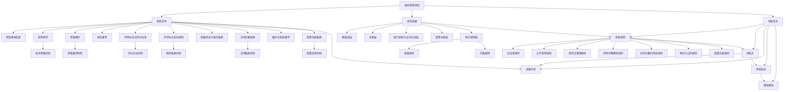

# 政府采购招标文件合规审查本体结构图

## 说明

这份文档用于把“政府采购招标文件合规审查”业务的核心对象、关系和输出结构明确下来，作为后续规则库、数据结构、提示词和界面设计的共同底图。

## 本体结构图

## 核心对象

### 1. 政府采购项目

代表一次完整的采购行为，是所有规则、文件、审查结论的宿主对象。

建议至少包含以下属性：

- 项目名称
- 采购人
- 代理机构
- 采购方式
- 采购类别
- 预算金额
- 适用区域
- 项目阶段

### 2. 采购文件

代表待审查的招标文件或其组成部分，是风险识别的主要载体。

建议拆成：

- 文件级对象
- 章节级对象
- 条款级对象

### 3. 规范依据

代表支撑审查的法律、行政法规、规章、政策和地方规则。

建议至少包含以下属性：

- 规则名称
- 规则层级
- 生效状态
- 适用区域
- 约束对象
- 约束主题

### 4. 审查规则

代表将法规要求转成可执行审查逻辑后的规则单元。

建议至少包含以下属性：

- 规则编号
- 规则名称
- 所属一级规则域
- 适用文件模块
- 触发条件
- 风险等级建议
- 证据抽取要求

### 5. 风险点

代表一次被识别出的具体问题，是系统输出的核心对象。

建议至少包含以下属性：

- 风险标题
- 风险类别
- 风险等级
- 命中规则
- 证据位置
- 风险说明
- 是否需要人工复核

### 6. 证据片段

代表支撑风险判断的文本、章节或结构化片段。

建议至少包含以下属性：

- 文件名
- 页码或段落位置
- 原文片段
- 命中原因

### 7. 审查结论

代表对整份文件或某一模块的审查结果汇总。

建议至少包含以下属性：

- 总体结论
- 一级规则域风险分布
- 高风险问题列表
- 待人工确认问题列表
- 未命中但建议关注的问题

### 8. 整改建议

代表面向审核人员或编制人员的修订建议。

建议至少包含以下属性：

- 建议动作
- 建议修改方向
- 对应依据
- 影响范围

## 核心关系

建议在后续数据模型中至少保留以下关系：

- `采购项目` 包含 `采购文件`
- `采购文件` 包含 `章节`
- `章节` 包含 `条款`
- `条款` 受约束于 `规范依据`
- `规范依据` 映射为 `审查规则`
- `审查规则` 触发 `风险点`
- `风险点` 关联 `证据片段`
- `风险点` 汇入 `审查结论`
- `审查结论` 生成 `整改建议`

## 产品化含义

这张图对产品设计至少有四个直接含义：

1. 系统不能只保留“结论文本”，还要保留对象之间的关系。
2. 风险识别必须能回溯到条款、规则和证据。
3. 审查规则不能只按法规组织，还要按文件模块和风险域组织。
4. 地方规则必须作为正式维度进入规则体系，而不是后补说明。

## 当前建议

后续如果进入产品设计阶段，可以基于这张图继续拆三套具体模型：

- 规则库数据模型
- 文件解析与条款抽取模型
- 风险输出与整改建议模型
