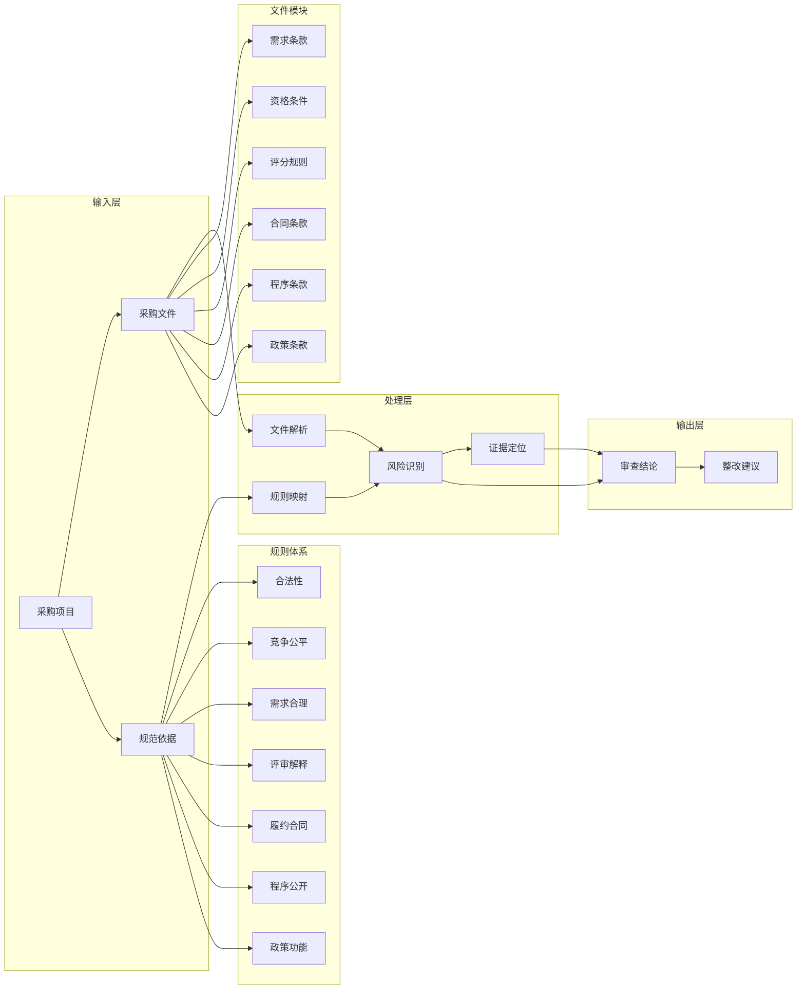

# 政府采购招标文件合规审查本体结构图

## 说明

这份文档用于把“政府采购招标文件合规审查”业务的核心对象、关系和输出结构明确下来，作为后续规则库、数据结构、提示词和界面设计的共同底图。

## 本体结构图

## 核心对象

### 1. 政府采购项目

代表一次完整的采购行为，是所有规则、文件、审查结论的宿主对象。

建议至少包含以下属性：

- 项目名称
- 采购人
- 代理机构
- 采购方式
- 采购类别
- 预算金额
- 适用区域
- 项目阶段

### 2. 采购文件

代表待审查的招标文件或其组成部分，是风险识别的主要载体。

建议拆成：

- 文件级对象
- 章节级对象
- 条款级对象

### 3. 规范依据

代表支撑审查的法律、行政法规、规章、政策和地方规则。

建议至少包含以下属性：

- 规则名称
- 规则层级
- 生效状态
- 适用区域
- 约束对象
- 约束主题

### 4. 审查规则

代表将法规要求转成可执行审查逻辑后的规则单元。

建议至少包含以下属性：

- 规则编号
- 规则名称
- 所属一级规则域
- 适用文件模块
- 触发条件
- 风险等级建议
- 证据抽取要求

### 5. 风险点

代表一次被识别出的具体问题，是系统输出的核心对象。

建议至少包含以下属性：

- 风险标题
- 风险类别
- 风险等级
- 命中规则
- 证据位置
- 风险说明
- 是否需要人工复核

### 6. 证据片段

代表支撑风险判断的文本、章节或结构化片段。

建议至少包含以下属性：

- 文件名
- 页码或段落位置
- 原文片段
- 命中原因

### 7. 审查结论

代表对整份文件或某一模块的审查结果汇总。

建议至少包含以下属性：

- 总体结论
- 一级规则域风险分布
- 高风险问题列表
- 待人工确认问题列表
- 未命中但建议关注的问题

### 8. 整改建议

代表面向审核人员或编制人员的修订建议。

建议至少包含以下属性：

- 建议动作
- 建议修改方向
- 对应依据
- 影响范围

## 核心关系

建议在后续数据模型中至少保留以下关系：

- `采购项目` 包含 `采购文件`
- `采购文件` 包含 `章节`
- `章节` 包含 `条款`
- `条款` 受约束于 `规范依据`
- `规范依据` 映射为 `审查规则`
- `审查规则` 触发 `风险点`
- `风险点` 关联 `证据片段`
- `风险点` 汇入 `审查结论`
- `审查结论` 生成 `整改建议`

## 核心关系细化

下面把上述关系进一步细化为可落到数据模型和产品逻辑中的定义。

### 1. `采购项目` 包含 `采购文件`

#### 关系含义

一个采购项目会产生一组需要被审查的采购文件。这里的“采购文件”不一定只是一份正文，也可以包括公告、招标文件、澄清说明、补遗文件、合同草案等。

#### 关系方向

- 一个 `采购项目` 可以包含多个 `采购文件`
- 一个 `采购文件` 必须归属于一个 `采购项目`

#### 关键字段建议

- `project_id`
- `document_id`
- `document_type`
- `document_version`
- `is_current_version`

#### 产品含义

这层关系决定系统不能孤立审一份文件，而要支持“同一项目下多文件联审”和版本比对。

### 2. `采购文件` 包含 `章节`

#### 关系含义

采购文件在结构上应被拆分为可定位、可引用、可比较的章节单元，而不是只保留整篇文本。

#### 关系方向

- 一个 `采购文件` 包含多个 `章节`
- 一个 `章节` 归属于一个 `采购文件`

#### 关键字段建议

- `chapter_id`
- `chapter_title`
- `chapter_order`
- `page_range`
- `parent_chapter_id`

#### 产品含义

这层关系支撑目录导航、章节级风险分布、跨章节冲突检测和证据定位。

### 3. `章节` 包含 `条款`

#### 关系含义

章节下面还要继续切分到条款级，因为真正被规则命中、被人工修改、被报告引用的，通常不是整个章节，而是其中某个具体条款。

#### 关系方向

- 一个 `章节` 包含多个 `条款`
- 一个 `条款` 归属于一个 `章节`

#### 关键字段建议

- `clause_id`
- `clause_type`
- `clause_text`
- `clause_order`
- `normalized_text`

#### 产品含义

这层关系决定系统输出能否精确到“哪一句、哪一段、哪一条有风险”，也是生成整改建议的最小工作单元。

### 4. `条款` 受约束于 `规范依据`

#### 关系含义

不是所有规范都约束所有条款。不同条款类型会受到不同法律规则、政策规则和地方规则的约束。

#### 关系方向

- 一个 `条款` 可能受多个 `规范依据` 约束
- 一个 `规范依据` 也可能约束多个 `条款`

这是一个典型的多对多关系。

#### 关键字段建议

- `clause_id`
- `authority_id`
- `binding_strength`
- `applicable_region`
- `applicable_scope`

#### 产品含义

这层关系决定系统能否回答“这条款为什么有问题，依据是哪条规则”，也是地方规则接入的关键位置。

### 5. `规范依据` 映射为 `审查规则`

#### 关系含义

规范依据是法言法语，不能直接拿来逐条审查。需要把它转译为产品内可执行的审查规则。

#### 关系方向

- 一个 `规范依据` 可以映射为多条 `审查规则`
- 一条 `审查规则` 也可能同时对应多个 `规范依据`

这同样是多对多关系。

#### 关键字段建议

- `authority_id`
- `rule_id`
- `mapping_type`
- `rule_expression`
- `manual_review_required`

#### 产品含义

这层关系决定规则库如何建设。法规文本是依据层，审查规则是执行层，两者不能混成一个对象。

### 6. `审查规则` 触发 `风险点`

#### 关系含义

风险点不是凭空生成的，而是某条审查规则在特定条款或特定上下文中被触发后的结果。

#### 关系方向

- 一条 `审查规则` 可以触发多个 `风险点`
- 一个 `风险点` 至少应能回溯到一条 `审查规则`

#### 关键字段建议

- `risk_id`
- `rule_id`
- `trigger_mode`
- `trigger_score`
- `risk_level`

#### 产品含义

这层关系支撑风险追溯、规则命中解释、风险分级和后续模型评估。

### 7. `风险点` 关联 `证据片段`

#### 关系含义

风险点必须有证据，否则就只是一个模糊判断。证据片段可以是原文、对照条文、跨章节冲突对等。

#### 关系方向

- 一个 `风险点` 可以关联多个 `证据片段`
- 一个 `证据片段` 也可能被多个 `风险点` 复用

#### 关键字段建议

- `risk_id`
- `evidence_id`
- `evidence_type`
- `source_location`
- `quoted_text`

#### 产品含义

这层关系决定系统输出能否被审核人员信任，也决定报告能否支持人工复核和引用原文。

### 8. `风险点` 汇入 `审查结论`

#### 关系含义

单个风险点只是局部发现，审查结论需要把多个风险点聚合成针对整份文件、某个章节或某个规则域的综合判断。

#### 关系方向

- 一个 `审查结论` 汇总多个 `风险点`
- 一个 `风险点` 通常归属于一个主结论，但也可以被多个视角引用

#### 关键字段建议

- `review_result_id`
- `risk_id`
- `aggregation_scope`
- `summary_label`
- `priority_order`

#### 产品含义

这层关系支撑按文件、章节、规则域输出风险总览，也支撑“高风险优先展示”的报告排序逻辑。

### 9. `审查结论` 生成 `整改建议`

#### 关系含义

审查结论的目标不是停留在发现问题，而是支持修改动作，所以需要把结论进一步转换为可执行的整改建议。

#### 关系方向

- 一个 `审查结论` 可以生成多条 `整改建议`
- 一条 `整改建议` 应指向具体结论或具体风险点

#### 关键字段建议

- `recommendation_id`
- `review_result_id`
- `risk_id`
- `recommended_action`
- `recommended_rewrite_direction`

#### 产品含义

这层关系决定系统输出是否真正有业务价值。审核人员通常需要的不只是“有风险”，而是“建议如何改”。

## 关系分层建议

从实现角度，这些关系还可以再分成三层：

### 1. 结构关系

用于描述文件本身如何被拆解：

- `采购项目` -> `采购文件`
- `采购文件` -> `章节`
- `章节` -> `条款`

### 2. 规则关系

用于描述法规如何进入审查过程：

- `条款` -> `规范依据`
- `规范依据` -> `审查规则`
- `审查规则` -> `风险点`

### 3. 输出关系

用于描述系统如何形成业务结果：

- `风险点` -> `证据片段`
- `风险点` -> `审查结论`
- `审查结论` -> `整改建议`

## 建模建议

如果后续进入数据库或知识图谱设计阶段，建议至少遵循以下原则：

1. `规范依据` 与 `审查规则` 分表，不要混用。
2. `章节` 与 `条款` 分层存储，避免只能按整篇文本处理。
3. `风险点` 与 `审查结论` 分层，避免局部问题和总体结论混在一起。
4. `证据片段` 单独建模，避免证据只留在自由文本说明里。
5. 多对多关系优先通过中间表表达，方便后续支持地方规则和多证据场景。

## 产品化含义

这张图对产品设计至少有四个直接含义：

1. 系统不能只保留“结论文本”，还要保留对象之间的关系。
2. 风险识别必须能回溯到条款、规则和证据。
3. 审查规则不能只按法规组织，还要按文件模块和风险域组织。
4. 地方规则必须作为正式维度进入规则体系，而不是后补说明。

## 当前建议

后续如果进入产品设计阶段，可以基于这张图继续拆三套具体模型：

- 规则库数据模型
- 文件解析与条款抽取模型
- 风险输出与整改建议模型
