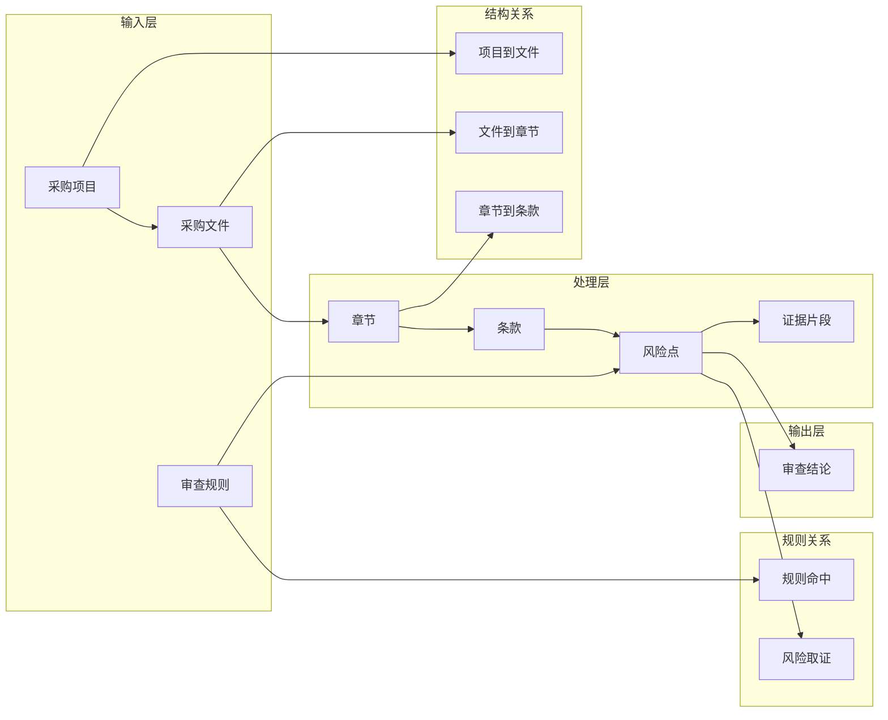

# V1 字段级数据模型（草案）

## 文档目的

这份文档用于定义 V1 阶段最小可用的数据模型，支撑以下能力：

- 文件解析
- 规则审查
- 风险输出
- 证据定位
- 结论汇总

## 建模原则

- 只保留 V1 必需对象，不提前设计重型模型
- 先保证“项目 -> 文件 -> 条款 -> 风险 -> 证据 -> 结论”链路完整
- 规则字段先服务于默认规则包和统一输出，不追求表达最复杂逻辑
- 字段设计优先支持当前产品边界和报告驱动模式

## 数据模型图

## 对象总表

| 对象 | 用途 | V1 是否必须 | 主要关联 |
| --- | --- | --- | --- |
| 采购项目 | 承载一次审查任务的业务上下文 | 必须 | 采购文件、审查结论 |
| 采购文件 | 承载待审查的招标文件正文和合同草案 | 必须 | 采购项目、章节、条款 |
| 章节 | 承载目录和结构定位 | 必须 | 采购文件、条款 |
| 条款 | 作为最小可审查单元 | 必须 | 采购文件、章节、风险点 |
| 审查规则 | 承载默认规则包和规则元数据 | 必须 | 风险点 |
| 风险点 | 承载运行时命中的问题结果 | 必须 | 条款、审查规则、证据片段、审查结论 |
| 证据片段 | 承载原文证据和解释支撑 | 必须 | 风险点、条款 |
| 审查结论 | 承载总体结论和报告输出 | 必须 | 采购项目、风险点 |

## 1. 采购项目

### 建议字段

| 字段 | 字段说明 |
| --- | --- |
| `project_id` | 项目唯一标识 |
| `project_name` | 项目名称 |
| `procurement_type` | 采购类型，V1 取值为货物或服务 |
| `procurement_method` | 采购方式，V1 取值为公开招标 |
| `region` | 适用区域，用于后续接入地方规则 |
| `budget_amount` | 预算金额，后续可支持需求合理性判断 |
| `status` | 项目状态，如待审查、审查中、已完成 |
| `created_at` | 项目创建时间 |

### 关系说明

- 一个采购项目可以关联多个采购文件
- 一个采购项目至少应关联一个审查结论

## 2. 采购文件

### 建议字段

| 字段 | 字段说明 |
| --- | --- |
| `document_id` | 文件唯一标识 |
| `project_id` | 所属采购项目标识 |
| `document_type` | 文件类型，V1 取值为招标文件正文或合同草案 |
| `document_name` | 文件名称 |
| `document_version` | 文件版本号 |
| `is_current_version` | 是否为当前有效版本 |
| `source_path` | 原始文件路径或存储位置 |
| `raw_text` | 文件解析后的全文文本 |
| `parsed_status` | 解析状态，如未解析、已解析、解析失败 |
| `created_at` | 文件入库时间 |

### 关系说明

- 一个采购文件归属于一个采购项目
- 一个采购文件可以拆出多个章节和多个条款

## 3. 章节

### 建议字段

| 字段 | 字段说明 |
| --- | --- |
| `chapter_id` | 章节唯一标识 |
| `document_id` | 所属文件标识 |
| `parent_chapter_id` | 父级章节标识，用于支持多级目录 |
| `chapter_title` | 章节标题 |
| `chapter_order` | 章节顺序号 |
| `page_start` | 起始页码 |
| `page_end` | 结束页码 |
| `chapter_text` | 章节原文 |

### 关系说明

- 一个章节归属于一个采购文件
- 一个章节可以包含多个条款

## 4. 条款

### 建议字段

| 字段 | 字段说明 |
| --- | --- |
| `clause_id` | 条款唯一标识 |
| `document_id` | 所属文件标识 |
| `chapter_id` | 所属章节标识 |
| `clause_type` | 条款类型，如资格条件、技术需求、评分规则、合同条款 |
| `clause_order` | 条款顺序号 |
| `clause_text` | 条款原文 |
| `normalized_text` | 清洗或标准化后的文本 |
| `location_label` | 可直接展示的位置标签，如第三章第2条 |

### 关系说明

- 一个条款归属于一个章节和一个采购文件
- 一个条款可以命中多个风险点

## 5. 审查规则

### 建议字段

| 字段 | 字段说明 |
| --- | --- |
| `rule_id` | 规则唯一标识 |
| `rule_code` | 规则编号，如 R1、R2 |
| `rule_name` | 规则名称 |
| `rule_domain` | 一级规则域 |
| `rule_subtype` | 二级细则名称 |
| `file_module` | 主要适用文件模块 |
| `execution_level` | 执行级别，如自动判定、辅助提示、人工复核 |
| `risk_level` | 默认风险等级，如高、中、低 |
| `target_description` | 规则要检测的问题描述 |
| `trigger_description` | 触发条件或触发逻辑描述 |
| `evidence_requirement` | 需要抽取什么证据 |
| `rule_basis` | 对外展示的规则依据 |
| `status` | 规则状态，如启用、停用、测试中 |
| `version` | 规则版本 |

### 关系说明

- 一条审查规则可以命中多个风险点
- V1 先不单独拆规范依据实体，由规则对象承载规则依据文本

## 6. 风险点

### 建议字段

| 字段 | 字段说明 |
| --- | --- |
| `risk_id` | 风险唯一标识 |
| `project_id` | 所属采购项目标识 |
| `document_id` | 所属文件标识 |
| `clause_id` | 命中条款标识 |
| `rule_id` | 命中规则标识 |
| `risk_title` | 风险标题 |
| `risk_level` | 风险级别 |
| `execution_level` | 该风险对应的执行级别 |
| `rule_domain` | 所属一级规则域 |
| `file_module` | 所属文件模块 |
| `location_label` | 风险在文件中的位置标签 |
| `risk_description` | 风险说明 |
| `status` | 风险状态，如已命中、已忽略、已确认 |
| `created_at` | 风险生成时间 |

### 关系说明

- 一个风险点至少关联一个条款和一条规则
- 一个风险点可以关联多个证据片段
- 一个风险点最终会被汇入审查结论

## 7. 证据片段

### 建议字段

| 字段 | 字段说明 |
| --- | --- |
| `evidence_id` | 证据唯一标识 |
| `risk_id` | 所属风险标识 |
| `document_id` | 所属文件标识 |
| `clause_id` | 关联条款标识 |
| `evidence_type` | 证据类型，如原文证据、结构冲突证据、缺失项证据 |
| `quoted_text` | 被引用的原文片段 |
| `location_label` | 证据位置标签 |
| `evidence_note` | 证据说明，解释为什么这段内容支持该风险 |

### 关系说明

- 一个证据片段至少归属于一个风险点
- 一个风险点可以有多个证据片段

## 8. 审查结论

### 建议字段

| 字段 | 字段说明 |
| --- | --- |
| `review_result_id` | 审查结论唯一标识 |
| `project_id` | 所属采购项目标识 |
| `summary_title` | 结论摘要标题 |
| `overall_conclusion` | 总体结论 |
| `high_risk_count` | 高风险数量 |
| `medium_risk_count` | 中风险数量 |
| `low_risk_count` | 低风险数量 |
| `auto_detect_count` | 自动判定命中数量 |
| `assist_detect_count` | 辅助提示命中数量 |
| `report_text` | 审查报告正文 |
| `created_at` | 审查结论生成时间 |

### 关系说明

- 一个审查结论归属于一个采购项目
- 一个审查结论汇总该项目下的多个风险点

## 最小外键关系

| 关系 | 说明 |
| --- | --- |
| `采购项目 1 -> N 采购文件` | 一个项目可包含多份待审文件 |
| `采购文件 1 -> N 章节` | 一份文件可拆成多级章节 |
| `章节 1 -> N 条款` | 一个章节可拆成多个条款 |
| `条款 1 -> N 风险点` | 一个条款可能命中多个风险 |
| `审查规则 1 -> N 风险点` | 一条规则可命中多个风险 |
| `风险点 1 -> N 证据片段` | 一个风险可对应多条证据 |
| `采购项目 1 -> 1 审查结论` | V1 默认每个项目汇总出一份结论 |

## 当前结论

V1 的最小数据模型应先保证以下主链路完整：

`采购项目 -> 采购文件 -> 章节 -> 条款 -> 风险点 -> 证据片段 -> 审查结论`

规则对象则作为贯穿审查链路的判断依据存在：

`审查规则 -> 风险点`

## 后续继续细化的方向

1. 审查规则与规范依据是否拆表
2. 风险点状态流转是否单独建模
3. 审查结论与风险点之间是否需要中间汇总表
4. 文件版本比对和多轮审查是否需要扩展模型
