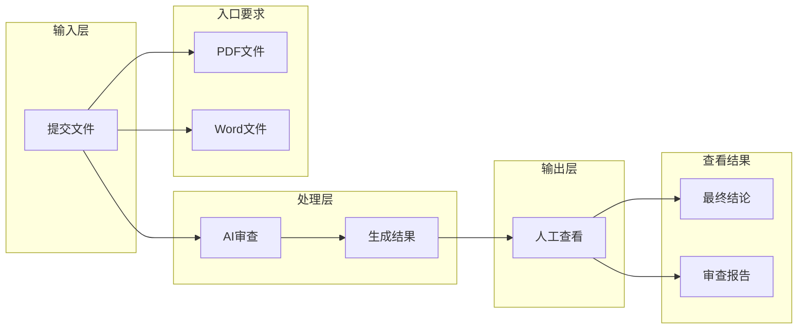

# V1 产品主流程（草案）

## 文档目的

这份文档用于沉淀当前已经讨论完成的 V1 产品主流程，作为后续继续拆分子流程和更细节点的上一级基线。

## 主流程总览

当前 V1 主流程定义为：

1. 文件进入系统
2. AI 发起审查
3. 生成审查结果
4. 人工查看结果

本版本暂不纳入“结果留存与流转”作为主流程节点。

## 主流程图

## 1. 文件进入系统

### 目标

审核人员提交一份待审核的招标文件，让系统形成一个可进入 AI 审查的输入对象。

### 触发角色

- 审核人员

### 当前已完成的二级节点

#### 1.1 文件提交格式

- 支持 `PDF`
- 支持 `Word`

### 当前结论

- 当前一次只支持提交 1 份文件
- 暂不要求同时提交合同草案
- 暂不要求填写额外项目信息
- 如果文件有问题，直接重新提交

## 2. AI 发起审查

### 目标

在文件进入系统后，由 AI 正式接手并开始执行审查任务。

### 当前已完成的二级节点

#### 2.1 审查触发方式

- 自动触发

#### 2.2 审查输入内容

- 用户提交的是原始文件
- AI 审查使用的是解析后的文件内容

#### 2.3 审查依据

- 默认规则包为主
- 固定审查任务指令为辅

#### 2.4 审查输出目标

- 风险点
- 证据片段
- 风险说明

### 当前结论

AI 在第 2 步的职责是完成自动审查，并产出后续可用于生成结果的中间审查结果。

## 3. 生成审查结果

### 目标

把 AI 审查阶段的中间结果，汇总成审核人员可以直接查看的最终输出。

### 当前已完成的二级节点

#### 3.1 最终输出内容

- 最终结论
- 审查报告

#### 3.2 结果生成方式

- 系统自动汇总生成

#### 3.3 结果生成完成标志

- 只要最终结论和审查报告生成成功即可

### 当前结论

系统在第 3 步负责把中间审查结果整理成审核人员主查看层的输出。

## 4. 人工查看结果

### 目标

让审核人员查看系统输出，并完成当前 V1 所需的人工消费动作。

### 当前已完成的二级节点

#### 4.1 人工查看对象

- 最终结论
- 审查报告

#### 4.2 人工查看后的动作

- 下载最终结论
- 下载审查报告

### 当前结论

V1 在人工侧的闭环到“查看并下载结果”为止，暂不纳入在线确认、审批流转等后续动作。

## 当前阶段结论

按照当前已完成的讨论，V1 主流程已经完成一级和必要二级节点的收口。

当前可以视为：

- 主流程层已讨论完成
- 后续应按分层准则进入更细一级，而不是重新跳回主流程一级泛谈

## 后续继续细化的顺序

根据当前分层准则，后续应按以下方式继续展开：

1. 从主流程的某一个一级节点进入更细层级
2. 完成该一级节点的当前层级讨论后，再进入下一支
3. 不跳级进入更深层问题
