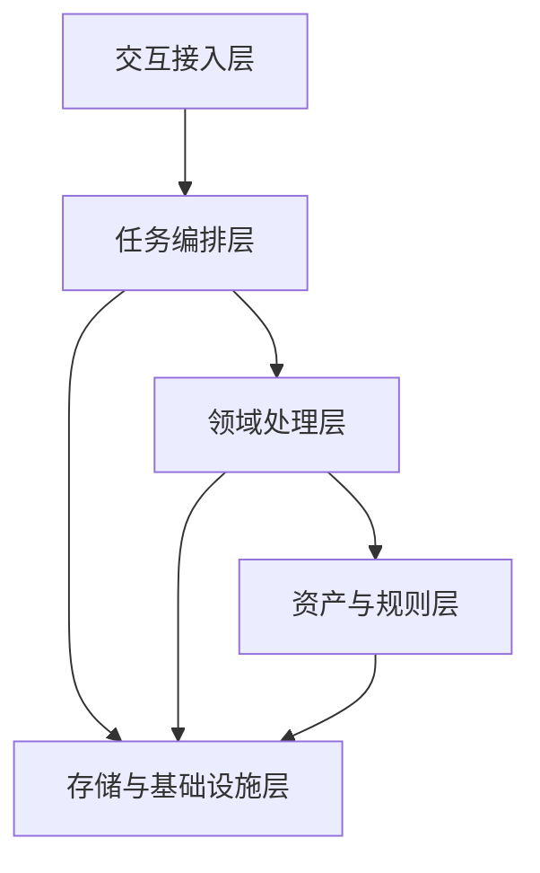
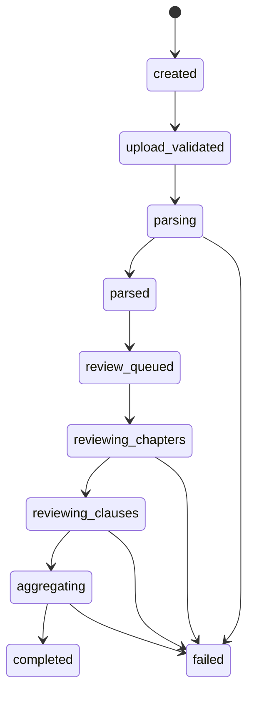

# V1 技术架构与分层方案（首版）

## 文档目的

这份文档用于在现有技术方案首包基础上，进一步统一 V1 的系统分层、核心模块边界、上传到审查结果的关键链路、状态流转和主要技术风险，作为进入开发前的架构总览文档。

## 1. 产品追溯

本方案直接追溯以下已确认文档：

- `docs/tasks/current.md`
- `docs/business/v1/overall-solution.md`
- `docs/business/v1/main-flow.md`
- `docs/business/v1/data-model.md`
- `docs/business/v1/page-and-result-spec.md`
- `docs/business/v1/review-task-instruction.md`
- `docs/business/v1/rule-config-examples.md`
- `docs/business/v1/acceptance-criteria.md`
- `docs/tech/v1/system-design.md`
- `docs/tech/v1/state-machine.md`
- `docs/tech/v1/implementation-prep-round-1.md`

如果架构设计与上述范围冲突，应先回提总负责人确认，不直接由技术侧扩写业务边界。

## 2. 当前架构目标

V1 架构只服务于当前已确认的最小闭环：

1. 上传 1 份 `PDF` 或 `Word`
2. 自动触发审查
3. 生成最终结论和审查报告
4. 在线查看与下载结果

因此架构优先保证：

- 主链路稳定
- 分层清晰
- 对象可追溯
- 状态可观测
- 后续可在不破坏外部接口的前提下替换内部实现

## 3. 系统分层

V1 当前建议采用五层结构。

### 3.1 交互接入层

负责：

- 文件上传入口
- 状态查询入口
- 结果查询与下载入口
- 页面服务适配

边界：

- 只负责接收请求、返回对象和做基础参数校验
- 不承载文件解析、规则判断和结果汇总逻辑

### 3.2 任务编排层

负责：

- 创建审查任务
- 推进任务状态
- 调度解析、审查和汇总阶段
- 承接异步任务队列

边界：

- 负责“流程怎么走”
- 不直接负责“规则怎么判”

### 3.3 领域处理层

负责：

- 文件解析与结构切分
- 审查输入装配
- 风险识别
- 证据抽取
- 结果汇总

边界：

- 负责“业务链路怎么处理”
- 不负责接口协议和最终页面展示

### 3.4 资产与规则层

负责：

- 默认规则包管理
- 固定审查任务指令管理
- 输出 schema 管理

边界：

- 负责把静态资产转成运行时稳定输入
- 不承担在线规则运营平台能力

### 3.5 存储与基础设施层

负责：

- 持久化存储
- 对象存储
- 异步任务队列
- 日志与基础监控

边界：

- 负责提供基础运行能力
- 不直接承载领域判断逻辑

## 4. 分层关系图

## 5. 核心模块边界

V1 当前核心模块建议收口为 7 个。

### 5.1 上传与查询模块

归属分层：

- 交互接入层

负责：

- 上传接口
- 状态查询接口
- 结果查询接口
- 下载接口

不负责：

- 解析
- 审查执行
- 结果聚合

### 5.2 任务编排模块

归属分层：

- 任务编排层

负责：

- 创建 `review_task`
- 投递解析任务
- 投递审查任务
- 投递汇总任务
- 推进任务状态

不负责：

- 文件格式具体解析
- 模型具体判定逻辑

### 5.3 文件解析模块

归属分层：

- 领域处理层

负责：

- 文件读取
- 文本提取
- 章节切分
- 条款切分
- 解析对象落地

不负责：

- 风险判定
- 结果展示

### 5.4 审查输入装配模块

归属分层：

- 领域处理层
- 资产与规则层

负责：

- 读取解析结果
- 读取规则包和任务指令
- 组装审查执行输入对象

不负责：

- 自行增改规则范围

### 5.5 审查执行模块

归属分层：

- 领域处理层

负责：

- 章节级初筛
- 条款级审查
- 输出风险点、证据片段和风险说明

不负责：

- 直接生成最终页面对象

### 5.6 结果汇总模块

归属分层：

- 领域处理层

负责：

- 风险归并
- 最终结论生成
- Markdown 报告生成
- 审查结果对象落地

不负责：

- 文件上传
- 文件解析

### 5.7 规则资产加载模块

归属分层：

- 资产与规则层

负责：

- 规则包加载
- 任务指令加载
- 运行时对象归一

不负责：

- 在线编辑规则
- 独立规则引擎求值

## 6. 上传到审查结果的关键链路

## 7. 关键链路分段说明

### 7.1 接入段

- 上传接口接收原始文件
- 创建 `task_id`
- 写入原始文件和基础元数据

### 7.2 解析段

- 根据文件类型进入对应解析器
- 统一输出 `raw_text`
- 切分章节和条款

### 7.3 审查准备段

- 加载默认规则包
- 加载固定审查任务指令
- 组装执行输入对象和输出 schema

### 7.4 审查执行段

- 先做章节级初筛，控制上下文规模
- 再做条款级审查，稳定输出结构化中间结果

### 7.5 汇总输出段

- 汇总风险点和证据片段
- 生成最终结论
- 生成审查报告 Markdown
- 提供结果查询和下载

## 8. 状态流转

### 8.1 对外状态

- `uploaded`
- `reviewing`
- `completed`
- `failed`

### 8.2 对内状态

- `created`
- `upload_validated`
- `parsing`
- `parsed`
- `review_queued`
- `reviewing_chapters`
- `reviewing_clauses`
- `aggregating`
- `completed`
- `failed`

### 8.3 状态流转图

### 8.4 状态与模块映射

| 状态阶段 | 主负责模块 |
| --- | --- |
| `created` / `upload_validated` | 上传与查询模块、任务编排模块 |
| `parsing` / `parsed` | 文件解析模块 |
| `review_queued` | 任务编排模块 |
| `reviewing_chapters` / `reviewing_clauses` | 审查执行模块 |
| `aggregating` | 结果汇总模块 |
| `completed` / `failed` | 当前执行模块写回，任务编排模块统一对外暴露 |

## 9. 主要技术风险

### 风险 1：长文处理导致审查不稳定

- 风险点：整份招标文件较长，直接送模可能导致上下文超长、耗时失控和输出波动。
- 当前策略：
  - 采用章节级初筛和条款级审查
  - 固定输出 schema
  - 审查输入由装配模块统一裁剪

### 风险 2：文件解析质量影响后续所有阶段

- 风险点：PDF / Word 解析不稳定会直接影响证据定位和条款切分。
- 当前策略：
  - 把解析作为独立阶段
  - 失败时直接进入 `failed`
  - 不在解析失败后继续进入审查阶段

### 风险 3：规则资产与模型输出不稳定对齐

- 风险点：规则字段如果不统一，模型输出会难以稳定映射到风险对象。
- 当前策略：
  - 规则包采用统一配置格式
  - 任务指令单独版本化
  - 运行时只消费归一后的规则对象

### 风险 4：异步链路状态不清导致排障困难

- 风险点：如果状态粒度过粗，会导致用户和开发都无法判断任务卡在哪一步。
- 当前策略：
  - 对外少状态，对内细状态
  - 所有关键阶段更新 `status_message`
  - 失败时记录 `error_code` 和 `error_message`

### 风险 5：结果层与中间结果不一致

- 风险点：如果最终结论脱离风险点和证据片段单独生成，会损害可解释性。
- 当前策略：
  - 结果汇总模块只基于已落地中间结果生成
  - 报告模板固定结构
  - 汇总前做一致性校验

## 10. 当前不做的架构内容

- 多文件联审架构
- 在线规则运营后台
- 复杂审批流
- 多角色工作台
- 外部法规检索增强
- 重型多 Agent 自治系统

这些内容不属于 V1 当前范围，若后续进入范围，应先更新产品和技术文档。

## 11. 开发进入条件

只要满足以下条件，就可以认为架构层已经足以支撑开发启动：

1. 分层和模块边界已明确
2. 上传到结果的主链路已明确
3. 状态流转已明确
4. 主要风险和当前缓解策略已明确
5. 接口、数据结构和实现准备文档可与本架构文档互相印证

## 12. 当前结论

V1 当前最适合采用“交互接入层 + 任务编排层 + 领域处理层 + 资产与规则层 + 存储与基础设施层”的五层结构，并围绕上传、解析、规则加载、审查执行、结果汇总这条主链路推进开发。这样既能保证边界清晰，也能在不扩大产品范围的前提下支撑最小闭环快速落地。
