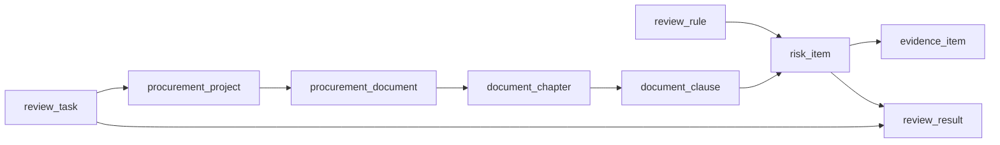

# V1 技术数据结构（首版）

## 文档目的

这份文档用于把业务侧字段级数据模型进一步收口成技术实现可用的对象结构，明确任务对象、审查对象和结果对象之间的关系。

## 1. 设计原则

- 延续业务文档中的 8 个核心对象
- 增加支撑异步执行所需的任务对象
- 优先定义逻辑结构，不预设具体数据库类型
- 字段命名优先稳定、易映射接口对象

## 2. 核心对象总览

V1 技术实现建议至少落以下 9 类对象：

1. `review_task`
2. `procurement_project`
3. `procurement_document`
4. `document_chapter`
5. `document_clause`
6. `review_rule`
7. `risk_item`
8. `evidence_item`
9. `review_result`

## 3. 对象关系图

## 4. 任务对象

### 4.1 `review_task`

用途：

- 承载一次上传到结果完成的异步执行链路

建议字段：

| 字段 | 类型建议 | 说明 |
| --- | --- | --- |
| `task_id` | string | 任务唯一标识 |
| `project_id` | string | 关联项目标识 |
| `document_id` | string | 关联文件标识 |
| `status` | string | 对外状态 |
| `internal_status` | string | 对内细分状态 |
| `status_message` | string | 当前状态说明 |
| `error_code` | string nullable | 失败码 |
| `error_message` | string nullable | 失败描述 |
| `retry_count` | integer | 当前重试次数 |
| `created_at` | datetime | 任务创建时间 |
| `started_at` | datetime nullable | 审查开始时间 |
| `completed_at` | datetime nullable | 审查完成时间 |
| `updated_at` | datetime | 最近更新时间 |

## 5. 业务对象

### 5.1 `procurement_project`

建议保留字段：

- `project_id`
- `project_name`
- `procurement_type`
- `procurement_method`
- `region`
- `budget_amount`
- `status`
- `created_at`

技术建议：

- V1 允许 `project_name` 为空，先由系统按文件名回填默认值
- `status` 可由 `review_task` 汇总映射，避免重复维护复杂状态

### 5.2 `procurement_document`

建议字段：

- `document_id`
- `project_id`
- `document_type`
- `document_name`
- `document_format`
- `source_uri`
- `storage_bucket`
- `raw_text`
- `parsed_status`
- `page_count`
- `created_at`

技术建议：

- `source_path` 技术上建议收口为 `source_uri`
- `document_format` 与 `document_type` 分离，避免格式和业务类别混用

### 5.3 `document_chapter`

建议字段：

- `chapter_id`
- `document_id`
- `parent_chapter_id`
- `chapter_title`
- `chapter_order`
- `page_start`
- `page_end`
- `chapter_text`

### 5.4 `document_clause`

建议字段：

- `clause_id`
- `document_id`
- `chapter_id`
- `clause_type`
- `clause_order`
- `clause_text`
- `normalized_text`
- `location_label`
- `page_start`
- `page_end`

技术建议：

- `location_label` 用于前端和报告展示
- 页码字段单独保留，便于后续做高亮定位

### 5.5 `review_rule`

建议字段：

- `rule_id`
- `rule_code`
- `rule_name`
- `rule_domain`
- `rule_subtype`
- `file_module`
- `execution_level`
- `risk_level`
- `target_description`
- `trigger_description`
- `evidence_requirement`
- `rule_basis`
- `status`
- `version`

技术建议：

- 默认规则包配置加载后应归一为此结构
- 后续即使更换规则来源，对执行层仍暴露同一对象

## 6. 运行结果对象

### 6.1 `risk_item`

建议字段：

| 字段 | 说明 |
| --- | --- |
| `risk_id` | 风险唯一标识 |
| `task_id` | 所属任务 |
| `project_id` | 所属项目 |
| `document_id` | 所属文件 |
| `clause_id` | 命中条款 |
| `rule_id` | 命中规则 |
| `risk_title` | 风险标题 |
| `risk_level` | 风险级别 |
| `execution_level` | 执行级别 |
| `rule_domain` | 一级规则域 |
| `file_module` | 文件模块 |
| `location_label` | 命中位置 |
| `risk_description` | 风险说明 |
| `review_reasoning` | 结构化说明，可选 |
| `status` | 风险状态 |
| `created_at` | 生成时间 |

### 6.2 `evidence_item`

建议字段：

- `evidence_id`
- `risk_id`
- `document_id`
- `clause_id`
- `evidence_type`
- `quoted_text`
- `location_label`
- `evidence_note`
- `page_start`
- `page_end`

### 6.3 `review_result`

建议字段：

| 字段 | 说明 |
| --- | --- |
| `result_id` | 结果唯一标识 |
| `task_id` | 所属任务 |
| `project_id` | 所属项目 |
| `document_id` | 所属文件 |
| `status` | 结果状态 |
| `summary_title` | 摘要标题 |
| `overall_conclusion` | 最终结论 |
| `report_markdown` | 审查报告 Markdown |
| `conclusion_markdown` | 最终结论 Markdown |
| `risk_count_high` | 高风险数量 |
| `risk_count_medium` | 中风险数量 |
| `risk_count_low` | 低风险数量 |
| `generated_at` | 生成时间 |

## 7. 资产对象建议

虽然 V1 不做复杂规则运营，但技术侧建议保留两类静态资产：

### 7.1 `rule_pack_asset`

- `rule_pack_id`
- `rule_pack_name`
- `version`
- `content_json`
- `status`

### 7.2 `prompt_asset`

- `prompt_id`
- `prompt_name`
- `version`
- `content_text`
- `status`

这两类资产可先以文件形式存在，运行时加载为内存对象，不强制要求首版入库。

## 8. 最小持久化建议

V1 首版至少要持久化：

- `review_task`
- `procurement_document`
- `document_clause`
- `review_rule`
- `risk_item`
- `evidence_item`
- `review_result`

当前最小代码实现已正式落地 `review_result`，并为结果产物补充：

- `report_file_path`
- `conclusion_file_path`

用于支撑结果页查看和 Markdown 下载能力的后续实现。

如果时间有限，`procurement_project` 和 `document_chapter` 可先以轻量表或文档形式落地，但字段语义应提前固定。

## 9. 接口映射建议

| 接口对象字段 | 来源对象 |
| --- | --- |
| `task_id` | `review_task.task_id` |
| `file_name` | `procurement_document.document_name` |
| `status` | `review_task.status` |
| `message` | `review_task.status_message` |
| `overall_conclusion` | `review_result.overall_conclusion` |
| `report_markdown` | `review_result.report_markdown` |

### 9.1 结果页对象补充映射

当前最小代码实现另外存在一个服务端渲染结果页对象，可视为页面层 view model。

建议字段：

| 页面对象字段 | 来源对象 |
| --- | --- |
| `page_state` | 页面状态机派生值 |
| `status_label` | 页面状态文案 |
| `summary_title` | `review_result.summary_title` 或固定状态标题 |
| `overall_conclusion` | `review_result.overall_conclusion` 或 `review_task.status_message` |
| `title` | `summary_title` 的兼容别名 |
| `message` | `overall_conclusion` 的兼容别名 |
| `file_name` | `procurement_document.document_name` |
| `conclusion_markdown` | `review_result.conclusion_markdown` |
| `report_markdown` | `review_result.report_markdown` |
| `risk_count_summary` | `review_result` 聚合字段映射 |
| `top_risks` | `risk_item` 展示摘要 |
| `downloadable_files` | 结果下载对象列表 |
| `page_guidance` | 页面主引导文案 |
| `primary_actions` | 页面主操作按钮列表 |
| `support_notes` | 页面辅助说明列表 |

技术说明：

- `summary_title` 与 `overall_conclusion` 是当前页面对象的规范字段
- `title` 与 `message` 当前保留为兼容字段，后续如页面消费完全收口，可再决定是否移除

## 10. 当前结论

V1 技术数据结构在业务 8 个核心对象基础上补入 `review_task`，就足以支撑异步执行、状态查询和结果交付。首版重点不是把模型做重，而是把主链路上的对象关系固定下来。
