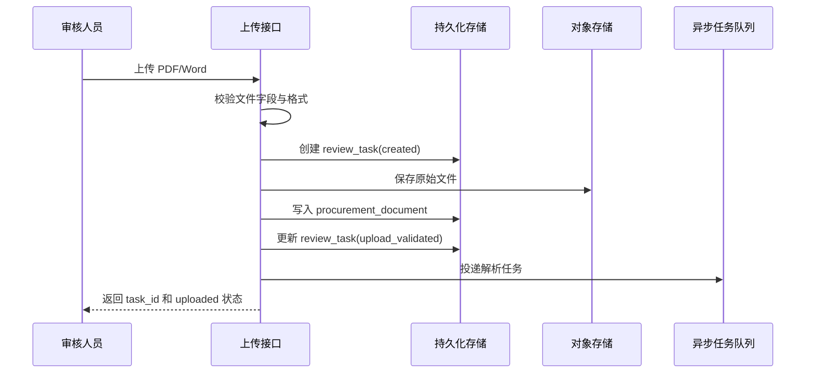

# V1 实现准备第一轮（首版）

## 文档目的

这份文档用于承接 V1 技术方案首包，收口当前实现准备第一轮的边界、目标和最小落地物，确保开发可以直接从这里开始拆解上传接口、任务状态模型、文件解析链路和规则资产加载。

## 1. 产品追溯

本轮实现准备直接追溯以下已确认文档：

- `docs/tasks/current.md`
- `docs/tech/v1/system-design.md`
- `docs/tech/v1/state-machine.md`
- `docs/tech/v1/api-spec.md`
- `docs/tech/v1/data-schema.md`
- `docs/business/v1/overall-solution.md`
- `docs/business/v1/main-flow.md`
- `docs/business/v1/review-task-instruction.md`
- `docs/business/v1/rule-config-examples.md`
- `docs/business/v1/acceptance-criteria.md`

如果本轮实现准备与上述文档存在冲突，应优先回提总负责人，而不是直接改写业务边界。

## 2. 本轮实现准备边界

### 2.1 本轮只做

1. 上传接口准备
2. 任务状态模型准备
3. 文件解析链路准备
4. 规则资产加载准备

### 2.2 本轮不做

- 审查执行器具体提示词调优
- 风险识别与证据抽取实现细节
- 最终结论与报告聚合逻辑细化
- 页面交互细节实现
- 多文件任务、审批流和规则后台

本轮目标是“让开发真正能开工”，而不是在本轮把所有后续链路一次讲完。

## 3. 本轮目标

本轮结束后，应达到以下状态：

1. 上传接口的请求、校验、落库和异步触发顺序已经明确
2. 任务状态对象和状态字段已经可直接建模
3. 文件解析链路的输入输出、阶段切分和失败策略已经明确
4. 默认规则包和固定审查任务指令的资产目录、文件格式和加载输出已经明确

## 4. 实现准备总览

| 主题 | 本轮目标 | 直接产物 |
| --- | --- | --- |
| 上传接口 | 明确接口执行顺序和最小校验 | 上传处理时序与错误码约定 |
| 任务状态模型 | 明确任务对象字段和状态更新责任 | 任务状态写入规则 |
| 文件解析链路 | 明确解析阶段拆分和输出对象 | 解析流水线与失败策略 |
| 规则资产加载 | 明确资产存放与运行时装配方式 | 规则包与任务指令加载约定 |

## 5. 上传接口准备

### 5.1 目标

让开发能够直接实现 `POST /api/v1/review-tasks`，并保证上传成功后可以稳定创建任务和启动后续异步链路。

### 5.2 推荐处理时序



### 5.3 接口最小职责

- 接收 `multipart/form-data`
- 校验文件是否存在
- 校验扩展名和 MIME 是否属于 `PDF` 或 `Word`
- 创建 `task_id`
- 持久化原始文件元数据
- 异步投递解析任务
- 返回上传结果对象

### 5.4 上传失败策略

| 场景 | 返回方式 | 是否创建任务 |
| --- | --- | --- |
| 文件字段缺失 | `400` | 否 |
| 文件格式不支持 | `415` | 否 |
| 文件校验失败 | `422` | 否 |
| 存储失败 | `500` 或内部错误对象 | 是，标记为 `failed` |

### 5.5 当前实现建议

- 上传接口只做“接收、校验、落库、投递”
- 不在请求线程内执行解析
- 返回对象严格对齐 `docs/tech/v1/api-spec.md`

## 6. 任务状态模型准备

### 6.1 目标

让开发可以直接创建 `review_task` 对象，并按状态机稳定推进任务。

### 6.2 核心状态字段

任务模型应至少落以下字段：

- `task_id`
- `project_id`
- `document_id`
- `status`
- `internal_status`
- `status_message`
- `error_code`
- `error_message`
- `retry_count`
- `created_at`
- `started_at`
- `completed_at`
- `updated_at`

### 6.3 状态写入责任

| 阶段 | 负责模块 | 写入要求 |
| --- | --- | --- |
| 任务创建 | 上传接口 | 写入 `created` |
| 文件校验完成 | 上传接口 | 写入 `upload_validated` |
| 解析开始 | 文件处理模块 | 写入 `parsing` |
| 解析完成 | 文件处理模块 | 写入 `parsed` |
| 审查入队 | 审查编排模块 | 写入 `review_queued` |
| 聚合开始 | 结果汇总模块 | 写入 `aggregating` |
| 完成 | 结果汇总模块 | 写入 `completed` |
| 失败 | 当前执行模块 | 写入 `failed` 和错误信息 |

### 6.4 对外状态约束

- 对外接口只暴露 `uploaded`、`reviewing`、`completed`、`failed`
- 内部状态不能直接泄漏到页面
- 页面提示文案统一来源于 `status_message`

### 6.5 当前实现建议

- 先以状态机文档为准，不另发明新状态
- 所有关键阶段都要更新 `updated_at`
- 失败信息必须结构化记录，便于后续排障

## 7. 文件解析链路准备

### 7.1 目标

让开发明确“原始文件进入后如何变成后续审查可消费的结构对象”。

### 7.2 解析流水线


### 7.3 阶段拆分

#### 7.3.1 文件读取

- 读取对象存储中的原始文件
- 判断是否可进入对应解析器

#### 7.3.2 文本提取

- `PDF` 走 PDF 文本提取流程
- `Word` 走 Word 文本提取流程
- 输出统一的 `raw_text`

#### 7.3.3 元数据提取

- 页数
- 文件名称
- 文件格式
- 解析时间

#### 7.3.4 章节切分

- 基于目录标题、编号模式和结构特征切章节
- 产出 `document_chapter`

#### 7.3.5 条款切分

- 在章节内继续按编号和段落模式切条款
- 产出 `document_clause`

### 7.4 解析输出要求

解析成功后至少要落以下对象：

- `procurement_document`
- `document_chapter`
- `document_clause`

同时更新：

- `procurement_document.parsed_status`
- `review_task.internal_status`

### 7.5 解析失败策略

| 失败点 | 处理原则 |
| --- | --- |
| 文件无法读取 | 直接失败，记录错误码 |
| 文本提取为空 | 直接失败，不继续切分 |
| 章节切分失败 | 允许保留全文并失败，不进入审查阶段 |
| 条款切分失败 | 允许保留章节，但整体任务置为失败 |

### 7.6 当前实现建议

- 解析链路先保证稳定，不追求复杂版面还原
- `PDF` 与 `Word` 可以有不同解析器，但输出对象必须统一
- V1 不建议在解析阶段做复杂语义理解

## 8. 规则资产加载准备

### 8.1 目标

让开发明确默认规则包和固定审查任务指令应如何存放、加载和输出到审查执行层。

### 8.2 资产目录建议

建议在后续代码实现中采用以下目录形态：

```text
assets/
  review/
    rule-packs/
      default-rule-pack.v1.yaml
    prompts/
      review-task-instruction.v1.md
```

### 8.3 规则包加载约定

- 输入：`YAML` 文件
- 加载后输出：`review_rule[]`
- 校验点：
  - 必须存在 `rule_code`
  - 必须存在 `rule_name`
  - 必须存在 `rule_domain`
  - 必须存在 `execution_level`
  - 必须存在 `risk_level`
  - 必须存在 `version`

### 8.4 任务指令加载约定

- 输入：版本化文本文件
- 加载后输出：
  - `prompt_id`
  - `prompt_name`
  - `version`
  - `content_text`

### 8.5 运行时装配方式

运行时不直接把原始资产文件传给执行器，而是先装配成统一输入对象：

```json
{
  "document_context": {},
  "rule_pack": [],
  "task_instruction": {
    "version": "v1",
    "content": "..."
  },
  "output_schema": {}
}
```

### 8.6 当前实现建议

- 规则包和任务指令都应版本化
- 运行时只依赖加载后的统一对象，不依赖散落路径
- 如果资产缺失，应在加载阶段直接失败，不进入审查

## 9. 本轮最小交付清单

本轮结束时，开发至少应能据此开始实现以下事项：

1. 上传接口 handler
2. `review_task` 数据模型
3. 文件解析 worker
4. 规则包加载器
5. 固定任务指令加载器

## 10. 本轮验证方式

1. 上传接口执行顺序是否明确
2. 任务状态字段和写入责任是否明确
3. 解析链路是否明确输入、输出和失败策略
4. 规则资产是否明确存放目录、文件格式和运行时装配方式

## 11. 当前结论

V1 实现准备第一轮已经收口为四件事：上传接口、任务状态模型、文件解析链路、规则资产加载。只要先把这四块做成稳定实现物，开发就可以从方案阶段顺利进入最小主链路编码阶段。
