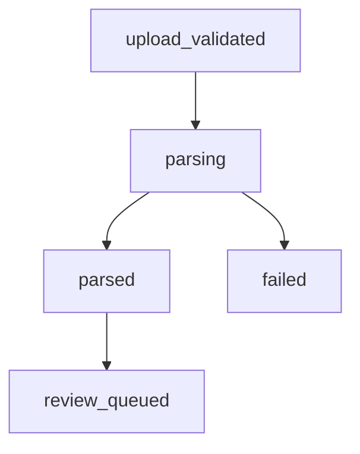

# V1 实现准备第十四轮（首版）

## 文档目的

这份文档用于承接输入侧产品收口结论，正式启动“解析链路可用化首轮实现准备”，并把真实解析、正文提取、切分块输出与失败分类映射到当前代码对象和状态流转。

## 1. 产品追溯

本轮实现直接追溯以下已确认文档：

- `docs/status/summary.md`
- `docs/tasks/t-now.md`
- `docs/tasks/current.md`
- `docs/business/v1/parsing-and-segmentation-minimum.md`
- `docs/tech/v1/implementation-prep-round-2.md`

若后续有人希望继续扩展 OCR、多文件合并、复杂版式恢复或平台化编排，应先回提总负责人，不在本轮直接展开。

## 2. 本轮目标

本轮只处理四件事：

1. 用最小真实解析链路替换当前字节直解占位实现
2. 将正文提取与可审查判定落到代码逻辑
3. 将切分块最小对象落到存储层
4. 将失败分类映射到任务失败码与状态提示

## 3. 本轮范围

### 3.1 本轮要做

1. 明确 `PDF` / `DOCX` / `DOC` 的最小解析方案
2. 增加统一解析模块，供 `ParseWorker` 调用
3. 新增切分块对象并持久化到 `metadata/blocks.json`
4. 将解析失败细分为“文件无法读取”“文件无可审查正文”“加密文件暂不支持”等最小类型
5. 补齐对应最小测试

### 3.2 本轮不做

- OCR
- 扫描件识别
- 复杂表格结构恢复
- 页级精确定位
- 多文件或附件联审

## 4. 当前实现设计

### 4.1 解析模块拆分

本轮新增统一解析模块 `app/document_parser.py`，作为输入侧第一层真实解析入口。

当前按文件后缀分三条最小路径：

1. `DOCX`
2. `PDF`
3. `DOC`

三条路径都输出统一对象：

- 清洗后的 `raw_text`
- `page_count`
- `blocks`

### 4.2 三类文件的最小实现方案

#### 4.2.1 DOCX

- 通过标准库 `zipfile` 打开压缩包
- 读取 `word/document.xml`
- 提取段落中的 `w:t` 文本
- 不读取页眉页脚，不做复杂样式恢复

#### 4.2.2 PDF

- 先识别是否含有 `/Encrypt`
- 对可读 `PDF` 先尝试提取文本绘制指令中的字符串
- 若提取不到，再退化到最小文本内容解码
- 不做 OCR

#### 4.2.3 DOC

- 采用最小兼容策略
- 优先尝试文本型内容解码
- 必要时退化到宽字符文本解码
- 当前不追求完全还原旧版二进制 Word 格式

### 4.3 正文提取与可审查判定

本轮把正文提取落成两步：

1. 轻清洗
2. 可审查判定

轻清洗当前只做：

- 统一换行
- 合并多空格
- 去掉空白行
- 去掉孤立页码
- 去掉明显重复的短页眉页脚

可审查判定当前只做最小规则：

- 文本长度达到最小阈值
- 至少形成多行连续正文
- 主要字符不是乱码

若不满足，则统一按 `DOCUMENT_NO_REVIEWABLE_TEXT` 进入失败态。

### 4.4 切分块输出对象

本轮新增 `block` 最小对象，对应产品文档中的切分块字段要求。

当前字段固定为：

- `block_id`
- `document_id`
- `block_type`
- `title`
- `text`
- `source_page_start`
- `source_page_end`
- `order_index`
- `parent_block_id`
- `source_anchor`

当前 `block_type` 只使用：

- `section`
- `clause`
- `paragraph`

这些块先写入 `metadata/blocks.json`，同时继续向下兼容现有 `chapter` / `clause` 存储，保证后续审查线程不需要本轮同步重构。

### 4.5 失败分类映射

本轮先落以下最小失败码：

1. `DOCUMENT_EMPTY`
2. `DOCUMENT_READ_FAILED`
3. `DOCUMENT_PASSWORD_PROTECTED`
4. `DOCUMENT_NO_REVIEWABLE_TEXT`
5. `DOCUMENT_PARSE_FAILED`

## 5. 状态流转

本轮不新增状态节点，只细化 `parsing -> failed` 的错误来源。

其中：

- 进入 `parsed` 表示已拿到可审查正文和切分块
- 进入 `failed` 表示当前文件在 V1 范围内无法形成可审查输入

## 6. 最小测试

本轮至少覆盖以下验证：

1. `DOCX` 能提取正文并进入 `review_queued`
2. `PDF` 能提取最小文本并进入 `review_queued`
3. `DOC` 能提取正文并进入 `review_queued`
4. 无可审查正文的文件会进入 `failed`
5. 切分块会写入 `metadata/blocks.json`

## 7. 当前结论

实现准备第十四轮的重点不是一次性做完高质量解析，而是把输入侧从“占位可跑”推进到“首轮可用”。

完成这一轮后，当前仓库已经具备：

- 面向 `PDF` / `DOCX` / `DOC` 的最小真实解析入口
- 正文轻清洗与可审查判定
- 可追溯的切分块对象
- 更清晰的失败分类与测试覆盖

下一步可以在此基础上继续做更细的解析精度收口或进入第二轮输入侧实现。
