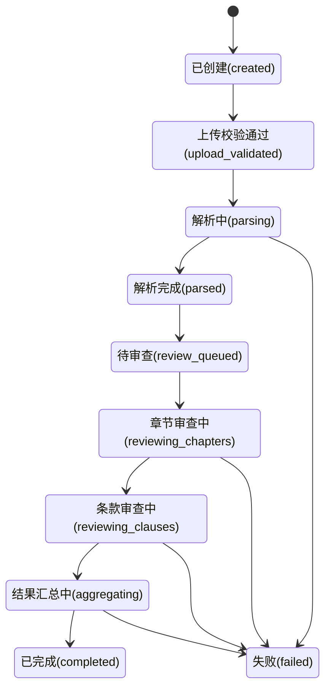

# V1 任务状态流转（首版）

## 文档目的

这份文档用于定义 V1 审查任务的状态机，统一上传、解析、审查、汇总和结果交付阶段的状态含义、流转条件和失败处理。

## 1. 状态设计目标

状态机需要满足：

- 对审核人员可解释
- 对开发与排障可定位
- 与页面状态保持一致
- 能覆盖失败场景

## 2. 对外状态与对内状态

### 2.1 对外状态

结果页和接口对外只暴露以下状态：

- `uploaded`
- `reviewing`
- `completed`
- `failed`

### 2.2 对内状态

系统内部补充分阶段状态，便于排障和重试：

- `created`
- `upload_validated`
- `parsing`
- `parsed`
- `review_queued`
- `reviewing_chapters`
- `reviewing_clauses`
- `aggregating`
- `completed`
- `failed`

## 3. 状态流转图

## 4. 状态定义

| 内部状态 | 对外状态 | 含义 | 进入条件 | 退出条件 |
| --- | --- | --- | --- | --- |
| `created` | `uploaded` | 任务已创建，文件已接收 | 上传接口写入任务 | 文件校验完成 |
| `upload_validated` | `uploaded` | 文件格式和大小校验通过 | 基础校验成功 | 解析任务启动 |
| `parsing` | `reviewing` | 正在解析文本和切分结构 | 进入解析流程 | 解析成功或失败 |
| `parsed` | `reviewing` | 文本和结构对象已生成 | 解析完成 | 审查任务入队 |
| `review_queued` | `reviewing` | 等待审查执行器处理 | 编排模块创建执行任务 | 开始章节审查 |
| `reviewing_chapters` | `reviewing` | 章节级初筛中 | 执行器开始章节级扫描 | 章节审查完成 |
| `reviewing_clauses` | `reviewing` | 条款级审查中 | 开始条款级判断 | 条款审查完成 |
| `aggregating` | `reviewing` | 正在生成最终结论和报告 | 中间结果已齐备 | 汇总成功或失败 |
| `completed` | `completed` | 结果已可查看与下载 | 汇总成功 | 无 |
| `failed` | `failed` | 当前任务处理失败 | 任一关键步骤失败 | 人工重提或重跑 |

## 5. 页面状态映射

| 页面 | 展示条件 |
| --- | --- |
| 上传页 | 尚未创建任务，或上传失败后重新提交 |
| 审核中状态页 | 对外状态为 `uploaded` 或 `reviewing` |
| 结果页 | 对外状态为 `completed` |
| 失败提示页或失败提示区 | 对外状态为 `failed` |

V1 虽然产品文档只强制要求 3 个页面，但技术上必须允许结果查询接口返回失败态，便于用户知晓任务未成功完成。

## 6. 状态流转规则

### 6.1 上传规则

- 上传成功后必须立即创建 `task_id`
- 未通过基础校验的文件不进入 `parsing`

### 6.2 解析规则

- 只有 `upload_validated` 才能进入 `parsing`
- 解析成功后必须产出 `document`、`chapter`、`clause` 基础对象

### 6.3 审查规则

- 只有 `parsed` 才能进入 `review_queued`
- 章节级初筛完成后才能进入条款级审查
- 条款级审查结束后才允许开始汇总

### 6.4 汇总规则

- 至少存在结构化风险结果或明确的“未发现明显风险”结果，才能结束汇总
- 最终结论和审查报告都生成成功，才可进入 `completed`

## 7. 失败处理规则

| 失败阶段 | 失败原因示例 | 处理原则 |
| --- | --- | --- |
| 上传校验 | 文件格式错误、文件为空 | 直接返回接口错误，不进入任务链路 |
| 解析 | 无法提取文本、结构切分失败 | 任务置为 `failed`，记录 `error_code` 和 `error_message` |
| 审查 | LLM 调用失败、输出不符合 schema | 允许有限重试，超过阈值后置为 `failed` |
| 汇总 | Markdown 生成失败、结论对象不完整 | 任务置为 `failed`，保留已有中间结果 |

## 8. 状态字段建议

任务对象建议至少包含：

- `task_id`
- `status`
- `internal_status`
- `status_message`
- `error_code`
- `error_message`
- `created_at`
- `updated_at`
- `started_at`
- `completed_at`

## 9. 验证方式

1. 上传成功后是否能立即查询到 `task_id`
2. 主链路是否能按顺序进入 `parsing`、`reviewing`、`aggregating`
3. 任一阶段失败时，接口是否能返回明确失败态
4. 页面是否只依赖有限对外状态即可展示

## 10. 当前结论

V1 采用“对外少状态、对内细状态”的状态机设计。这样既能保持页面和接口简单，也能满足开发排障和后续重试控制的需要。
